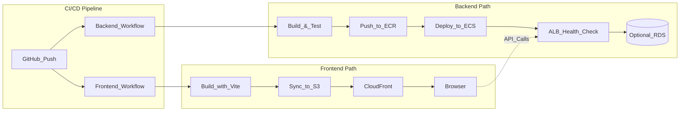

# DevOps Pipelines - Doublespot Example

這是一個完整的 end to end 範例專案，展示如何使用 Docker Compose 進行本地開發，以及透過 GitHub Actions CI/CD 將後端部署到 AWS ECS (Fargate)，前端部署到 S3 + CloudFront。

## 專案架構

### Backend 部署路徑
```
GitHub Actions → ECR → ECS (Fargate) → ALB → (可選) RDS MySQL
```

### Frontend 部署路徑
```
GitHub Actions → S3 → CloudFront → Browser
```

### 架構流程圖



## 本地開發

### 前置需求

- Docker 和 Docker Compose
- Node.js 20+（用於本地開發，可選）

### 啟動服務

1. 複製環境變數範例檔案（如果需要自訂配置）：
   ```bash
   cp backend/.env.example backend/.env
   cp frontend/.env.example frontend/.env
   ```

2. 啟動所有服務：
   ```bash
   docker compose up --build
   ```

   **注意：**
   - docker-compose 使用開發用的 Dockerfile（`Dockerfile.dev`），支援熱重載功能
   - 生產環境的 Dockerfile 用於 CI/CD 部署
   - Docker 環境使用固定端口（Backend: 3000, Frontend: 5173）
   - 本地開發（不用 Docker）可透過 `.env` 自訂端口

3. 驗證服務運行：
   - Backend: http://localhost:3000
   - Frontend: http://localhost:5173
   - Health Check: `curl http://localhost:3000/health`

4. 開發時修改程式碼會自動重載（無需重新 build）

### Health Check Endpoints

專案提供兩個健康檢查端點：

- **`GET /health`** - 簡單健康檢查（ALB 使用）
  - 返回：`200 OK` 和 `"ok"` 字串
  - 無外部依賴，適合 ALB 健康檢查

- **`GET /health/db`** - 資料庫連接檢查
  - 返回：JSON 格式的狀態資訊
  - 包含資料庫連接狀態

### 本地建置 Backend Docker 映像

**開發環境（帶熱重載）：**
```bash
cd backend
docker build -f Dockerfile.dev -t doublespot-backend:dev .
docker run -p 3000:3000 -v $(pwd):/app -v /app/node_modules doublespot-backend:dev
```

**生產環境（最佳化建置）：**
```bash
cd backend
docker build -t doublespot-backend:prod .
docker run -p 3000:3000 doublespot-backend:prod
```

## GitHub Actions CI/CD 設定

### 所需 GitHub Variables

在 GitHub Repository Settings → Secrets and variables → Actions 中設定以下 Variables：

#### Backend 部署所需
- `AWS_REGION` - AWS 區域（例如：`us-west-2`）
- `AWS_ROLE_TO_ASSUME` - OIDC IAM Role ARN（用於 GitHub Actions 認證）
- `ECR_REPOSITORY` - ECR 儲存庫名稱（例如：`doublespot-backend`）
- `ECS_CLUSTER` - ECS 叢集名稱
- `ECS_SERVICE` - ECS 服務名稱
- `CONTAINER_NAME` - ECS 容器名稱

#### Frontend 部署所需
- `AWS_REGION` - AWS 區域（例如：`us-west-2`）
- `AWS_ROLE_TO_ASSUME` - OIDC IAM Role ARN（用於 GitHub Actions 認證）
- `S3_BUCKET` - S3 儲存桶名稱（用於存放前端靜態檔案）
- `CLOUDFRONT_DISTRIBUTION_ID` - CloudFront 分配 ID
- `VITE_API_BASE_URL` - 前端建置時使用的 API 基礎 URL（例如：`https://api.example.com`）

### Workflows 說明

#### Backend CI/CD (`backend-ci-cd.yml`)

**觸發條件：**
- Push 到 `main` 分支
- 僅當 `backend/**` 路徑變更時觸發

**流程：**
1. Checkout 程式碼
2. Setup Node.js 20
3. 安裝依賴並建置（`npm ci` + `npm run build`）
4. 使用 OIDC 配置 AWS 憑證
5. 登入 Amazon ECR
6. 建置並推送 Docker 映像（使用 commit SHA 作為標籤）
7. 渲染 ECS Task Definition（替換 `__IMAGE_URI__` 佔位符）
8. 部署到 ECS 服務並等待穩定

#### Frontend Deploy (`frontend-deploy.yml`)

**觸發條件：**
- Push 到 `main` 分支
- 僅當 `frontend/**` 路徑變更時觸發

**流程：**
1. Checkout 程式碼
2. Setup Node.js 20
3. 安裝依賴
4. 建置前端（注入 `VITE_API_BASE_URL` 環境變數）
5. 使用 OIDC 配置 AWS 憑證
6. 同步 `dist/` 目錄到 S3（使用 `--delete` 移除舊檔案）
7. 無效化 CloudFront 快取

#### CI Pipeline (`pipeline.yaml`)

用於 Pull Request 檢查，執行：
- Backend 建置和類型檢查
- Frontend 建置和 Lint 檢查

## AWS 資源需求

本專案假設以下 AWS 資源已預先建立：

### Backend 所需資源
- ECR 儲存庫（用於存放 Docker 映像）
- ECS Cluster（Fargate）
- ECS Service（已配置的服務）
- Application Load Balancer (ALB) + Target Group
  - Health check 路徑設定為 `/health`
- IAM Role（用於 OIDC，信任 GitHub Actions）
- CloudWatch Log Group（`/ecs/doublespot-backend`）

### Frontend 所需資源
- S3 儲存桶（用於存放靜態檔案）
- CloudFront 分配（指向 S3 儲存桶）
- IAM Role（用於 OIDC，信任 GitHub Actions）

### Task Definition 範本

`backend/taskdef.template.json` 包含 ECS Task Definition 範本。在部署時，workflow 會自動替換以下佔位符：
- `__IMAGE_URI__` - 替換為實際的 ECR 映像 URI
- `__CONTAINER_NAME__` - 替換為 `CONTAINER_NAME` variable
- `__AWS_REGION__` - 替換為 `AWS_REGION` variable

**注意：** 您需要根據實際環境更新以下欄位：
- `executionRoleArn` - ECS Task Execution Role ARN
- `taskRoleArn` - ECS Task Role ARN（可選）
- `awslogs-group` - CloudWatch Log Group 名稱

## ALB 健康檢查設定

ALB Target Group 的健康檢查應設定為：
- **Path:** `/health`
- **Protocol:** HTTP
- **Port:** 3000
- **Healthy threshold:** 2
- **Unhealthy threshold:** 3
- **Timeout:** 5 秒
- **Interval:** 30 秒

`/health` 端點設計為快速且無外部依賴，確保 ALB 可以可靠地檢查服務狀態。

## 專案結構

```
devops-piplines/
├── backend/
│   ├── src/
│   │   ├── server.ts          # 伺服器啟動入口
│   │   ├── app.ts             # Express 應用配置
│   │   ├── routes/
│   │   │   └── health.route.ts # 健康檢查路由
│   │   └── config/
│   │       ├── env.ts         # 環境變數配置
│   │       └── db.ts          # 資料庫連接
│   ├── Dockerfile             # Backend 生產環境映像（多階段建置）
│   ├── Dockerfile.dev         # Backend 開發環境映像（熱重載）
│   ├── taskdef.template.json  # ECS Task Definition 範本
│   └── package.json
├── frontend/
│   ├── src/
│   │   ├── App.tsx
│   │   ├── main.tsx
│   │   └── pages/
│   │       └── Home.tsx
│   ├── Dockerfile             # Frontend 生產環境映像
│   ├── Dockerfile.dev         # Frontend 開發環境映像（熱重載）
│   └── package.json
├── .github/
│   └── workflows/
│       ├── backend-ci-cd.yml  # Backend 部署 workflow
│       ├── frontend-deploy.yml # Frontend 部署 workflow
│       └── pipeline.yaml      # CI 檢查 workflow
├── docker-compose.yml         # 本地開發配置
└── README.md
```

## 技術棧

- **Backend:** Node.js 20, TypeScript, Express
- **Frontend:** Vite, React, TypeScript
- **Database:** MySQL 8.4（可選，用於本地開發）
- **Container:** Docker, Docker Compose
- **CI/CD:** GitHub Actions
- **Cloud:** AWS (ECR, ECS Fargate, ALB, S3, CloudFront)

## 故障排除

### Docker Compose 無法啟動
- 確認 Docker 和 Docker Compose 已正確安裝
- 檢查端口 3000 和 5173 是否已被佔用
- 查看日誌：`docker compose logs`

### Health Check 失敗
- 確認 backend 服務正在運行：`curl http://localhost:3000/health`
- 檢查資料庫連接（如果使用）：`curl http://localhost:3000/health/db`

### GitHub Actions 部署失敗
- 確認所有必要的 GitHub Variables 已設定
- 檢查 AWS IAM Role 的信任關係是否正確配置（信任 GitHub）
- 確認 ECR、ECS、S3 等資源已正確建立
- 查看 workflow 執行日誌以獲取詳細錯誤訊息

## 授權

ISC
